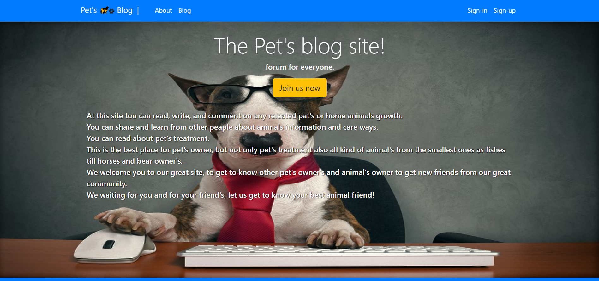
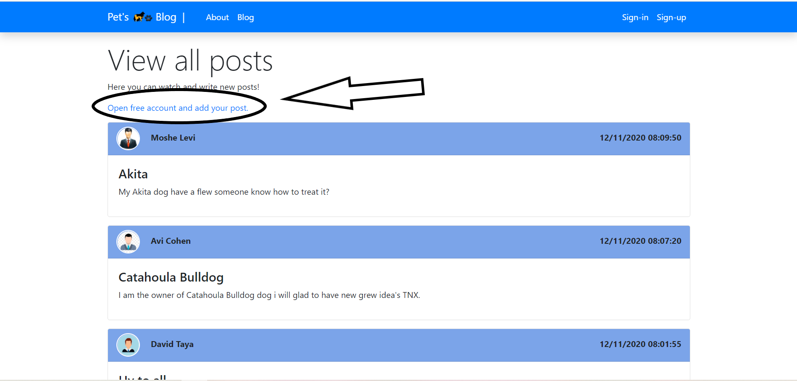
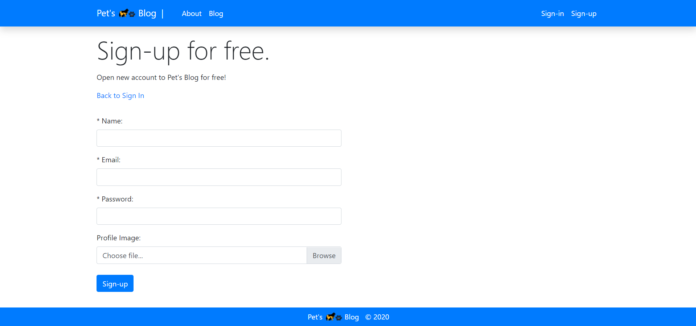
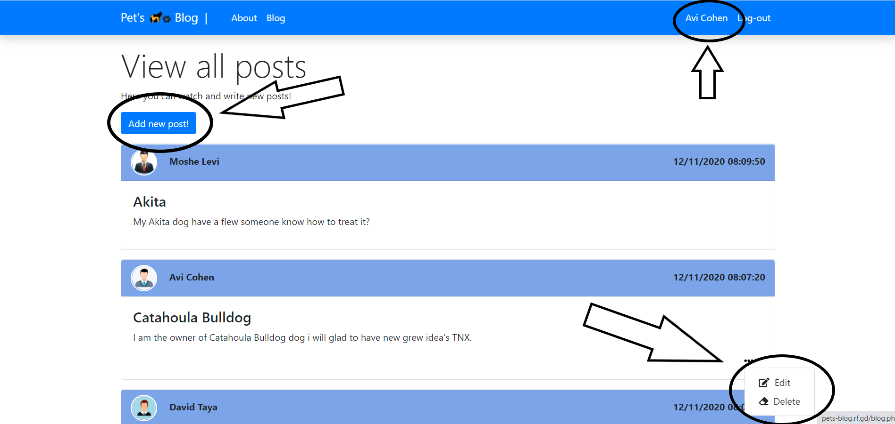

# Pet's Blog

## Tech

* [PHP]() - server scripting language, and a powerful tool for making dynamic and interactive Web pages.
* [MySQL]() - fully managed database service.

## Web Flow And Features

### Main page.

### Unregistered user can enjoy and read users posts(they have fast register button).

### register with profile image that will shown in the user posts.

### When register few options are opening to the user Create new posts, Edit and Delete.

## Installation

1. Activate `XAMPP` if you dont have `XAMPP` download from [here](https://www.apachefriends.org/download.html).

2. Drag the downloaded file into `C:\xampp\htdocs`.

3. Get into the browser to [http://localhost](http://localhost).

4. Press on Pet's Blog file. 

## Free Experience 

> "You can enjoy free access to **Pet's Blog** 
> with no download in [Click To Open](http://pets-blog.rf.gd) ."

